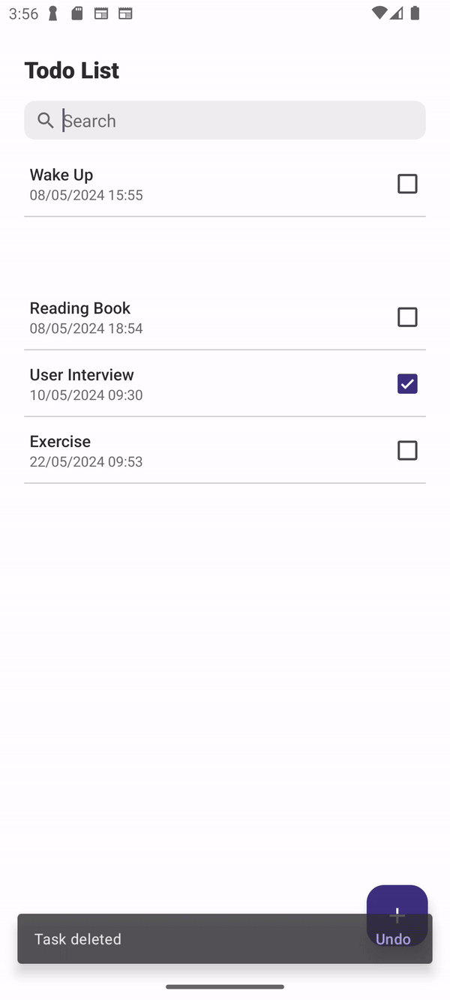
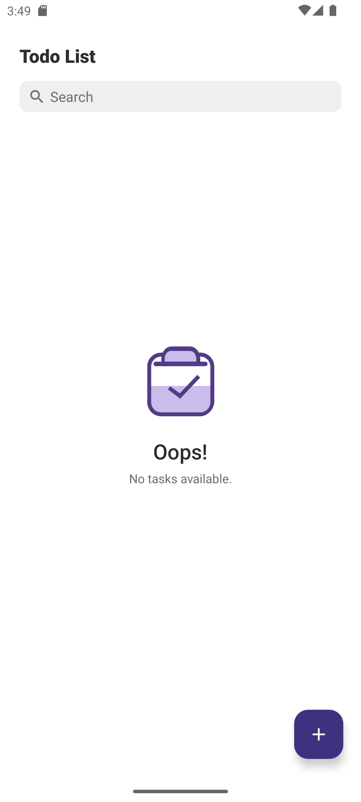
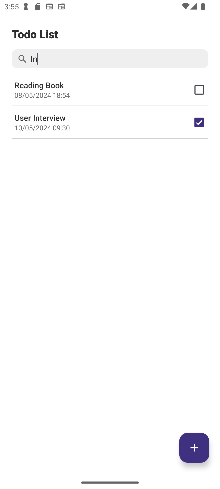
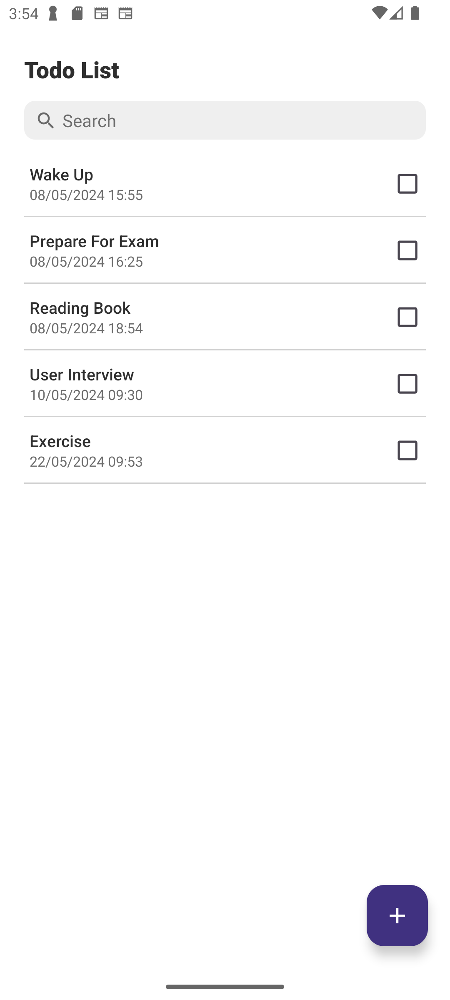
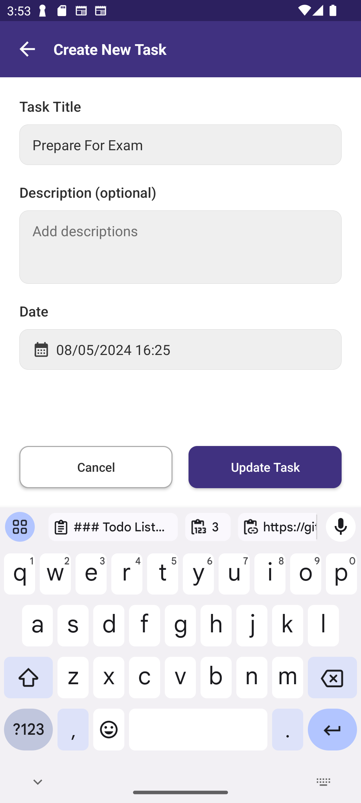

### Todo List App

This Todo List App is a simple yet powerful task management application designed to help users organize their daily tasks effectively. It utilizes modern Android development techniques and libraries such as Dagger Hilt, MVVM architecture, Room Database, Coroutines.

#### Preview Screenshots:

                    

#### Features:
- **Add, Edit, Delete Tasks**: Users can easily add, edit, and delete tasks with just a few taps.
- **Local Notifications**: The app provides local notifications to remind users of upcoming tasks, ensuring they never miss an important deadline.
- **Task Filtering and Searching**: Users can filter and search for tasks by name, making it easier to find specific tasks.
  
#### Installation:
1. Clone the repository: `git clone https://github.com/rikyahmad/ToDo-List.git`
2. Open the project in Android Studio.
3. Build and run the app on your device or emulator.

#### Usage:
- Add a new task by tapping the "+" button on the Task List screen.
- Edit a task by tapping on the task item and selecting the "Edit" option.
- Delete a task by swiping left on the task item.
- Mark a task as completed by tapping on the checkbox.
- Search for tasks by typing in the search bar.
- Receive notifications for upcoming tasks.

#### Contribution:
Contributions to the project are welcome! If you encounter any bugs or have ideas for improvements, feel free to open an issue or submit a pull request.

#### License:
This project is licensed under the [MIT License](LICENSE).

#### Contact:
For any inquiries or feedback, please contact [riky.fathoni@gmail.com](mailto:riky.fathoni@gmail.com).

Thank you for using Todo List App! Happy task managing! 🚀
